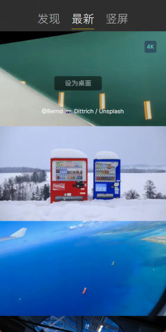
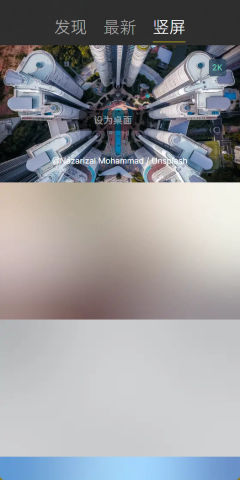

# Pap.erNet
参考MacOS上面的[pap.er](https://paper.photos)，采用[Avalonia](https://github.com/AvaloniaUI/Avalonia)跨平台技术实现的Windows /Liunx 下的壁纸软件。

## 开发
```bash
git clone https://github.com/HyokaChen/Pap.erNet.git
cd Pap.erNet/
./build-win.bat 或者 ./build-linux.bat
```

## 文档
#### 发现


#### 最新


#### 竖屏


#### 我的壁纸

#### 设置

## 更新日志
> v0.0.1
- 基础壁纸功能

## 其它
如果觉得本项目不错，请点击页面右上角的的小星星。也可以为作者点👍，欢迎打赏。


## 感谢项目/产品

- [AsyncImageLoader.Avalonia](https://github.com/AvaloniaUtils/AsyncImageLoader.Avalonia)的代码参考
- [pap.er](https://paper.photos) MacOS上的最美壁纸软件

## 协议
采用GPL-3.0 license


